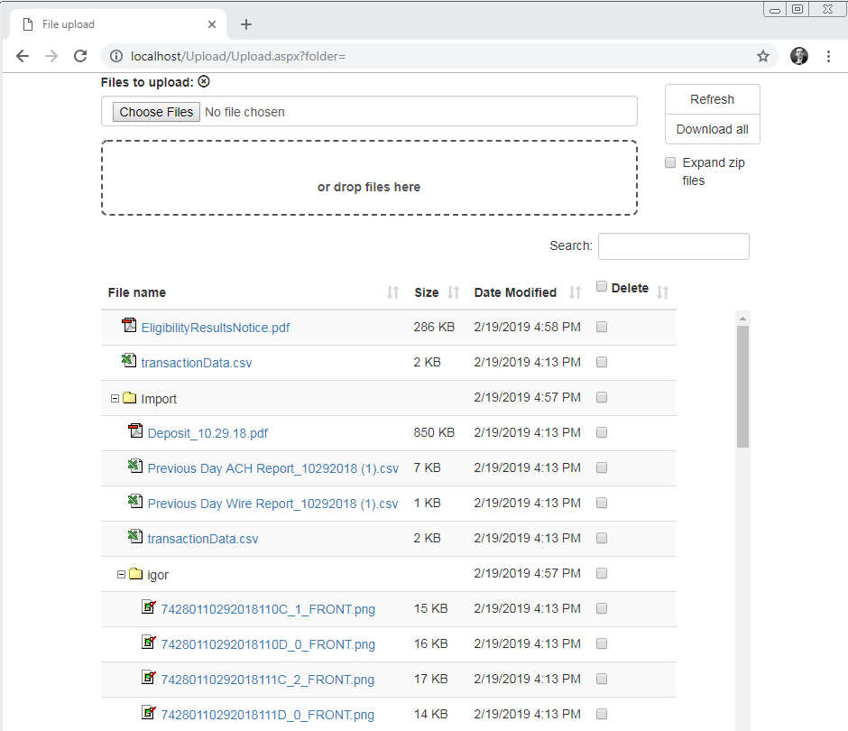
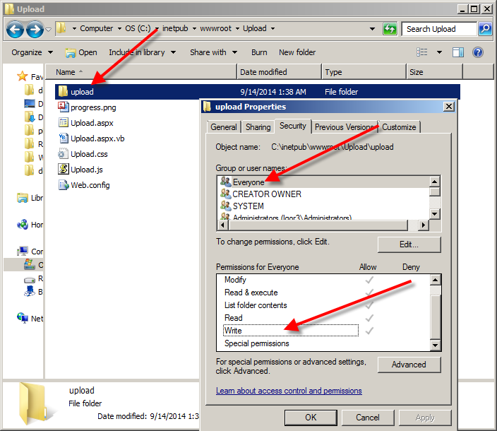
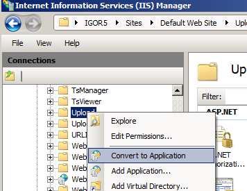

# Folder Tree with Multiple File Upload with Progress Bar and Drag and Drop

Originally posted here:
https://www.codeproject.com/Articles/1277781/Folder-Tree-with-Multiple-File-Upload-with-Progres

The ASP.NET pages let you upload, delete and browse files in a folder.

## Introduction
This ASP.NET application will let you upload multiple files manually or via drag and drop. It will show progress bar for each file as it uploads. A zip file can be extracted after the upload. Once uploaded, you can browse and delete these files and folders.

## Background
This is a sequel to my earlier article, Multiple file upload with progress bar and drag and drop. This version adds the following features:

- Ability to browse and expand folders
- Ability to zip and download all files
- Ability to upload and extract a zip file - this lets you create folders on the server
- Ability to search and sort files in the browser
  
This project uses:
- JQuery 1.12
- Bootstrap 3
- ICSharpCode.SharpZipLib.dll
- JavaScript Datatables.js

To use this application:

1. Download Upload3.zip and unzip it to C:\inetpub\wwwroot\Upload.
   
2. Give everyone (or the IIS anonymous user) access to C:\inetpub\wwwroot\Upload\upload folderBr>

3. In IIS Manager, right click Upload folder and convert it to Application.

4. Point your browser to http://localhost/Upload/Upload.aspx?folder=upload.
  
5. You can change URL from ?folder=upload to your folder like: folder=folder1 if you want to point the page to folder1.
